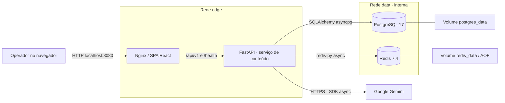
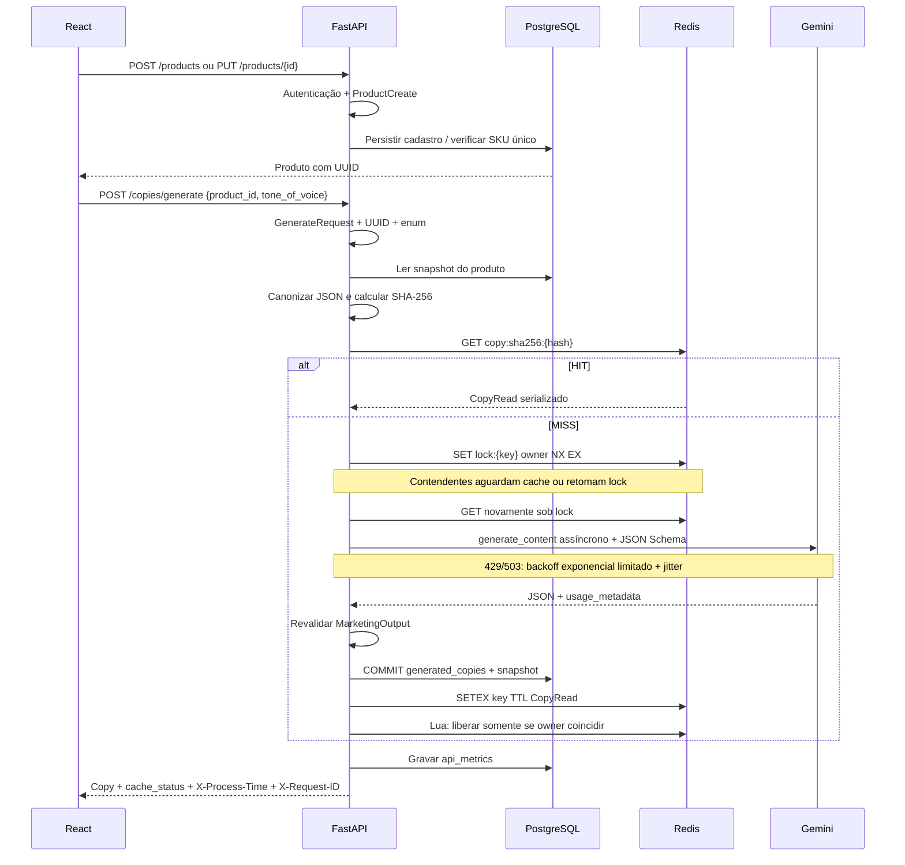
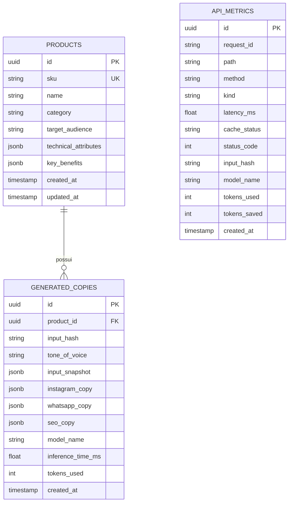

# Arquitetura e fluxo de dados

## Visão de implantação

O Redis é cache compartilhado e coordenador de concorrência, não a fonte definitiva do histórico. PostgreSQL é a fonte de verdade. Ambos ficam inacessíveis externamente por portas no Compose. A API participa também da rede edge, que permite saída HTTPS ao Gemini. O bundle frontend nunca contém a chave Gemini.

## Camadas

| Camada | Responsabilidade | Implementação |
|---|---|---|
| Interface web | Formulários, catálogo, previews, métricas | React + TypeScript + Tailwind, Zod, Recharts |
| Entrega HTTP | Rotas, autenticação, paginação | `src/routers`, `src/core/dependencies.py` |
| Contratos | Validação na borda e validação do LLM | `src/schemas` |
| Aplicação | Cache, coordenação, geração e persistência | `src/services/generation.py` |
| Integração IA | Prompt, schema, SDK async, retries | `src/services/llm.py` |
| Domínio persistido | Produtos, versões de copies, auditoria | `src/models` |
| Infraestrutura | Settings, engine, Redis, middleware | `src/core` |
| Evolução do banco | Migrações explícitas | `migrations/versions` |

É arquitetura em camadas. Os serviços dependem de contratos Pydantic e entidades SQLAlchemy; não se afirma independência total do framework. A fábrica `create_app` aceita provedor, sessão e cache injetados, permitindo testar o comportamento de integração.

## Sequência de geração

Uma entrada inválida retorna 422 antes de consultar o catálogo, Redis ou LLM para geração. O middleware ainda grava a falha na auditoria; portanto, validação na borda não significa ausência absoluta de I/O de observabilidade. O tempo informado no header e em `api_metrics.latency_ms` é medido antes dessa gravação.

## Canonização e identidade

1. Pydantic remove espaços externos, normaliza Unicode NFC e rejeita tipos/limites inválidos.
2. A canonização inclui UUID e todos os atributos cadastrais, inclusive SKU; benefícios são ordenados por terem semântica de conjunto.
3. Acrescenta tom, modelo/provedor efetivo, versão do prompt, versão do schema e temperatura.
4. Serializa com `sort_keys=True`, `ensure_ascii=False`, separadores compactos e codificação UTF-8.
5. Aplica SHA-256. O mesmo snapshot canônico também é enviado ao LLM.

Datas de cadastro não participam do hash. Reordenar chaves de JSON ou benefícios não gera um novo hash. Editar um atributo estável, tom, modelo ou versão do prompt gera outra chave. Alterações no prompt exigem incremento de `PROMPT_VERSION`; mudanças no contrato de saída exigem atualização da versão do schema em `hashing.py`.

O identificador do produto evita que um HIT de outro produto retorne uma FK incorreta. Excluir um produto remove as copies por FK `ON DELETE CASCADE`; chaves antigas expiram pelo TTL, mas não são acessíveis pela geração porque o produto é consultado antes do cache. Recriar o mesmo SKU produz outro UUID.

## Concorrência e consistência

- Lock Redis por hash com token aleatório; liberação atômica com Lua compara o proprietário.
- O trecho de geração/persistência/cache tem timeout total menor que o lease. O segundo GET após adquirir o lock evita corrida com outro worker.
- Redis usa `noeviction` para não expulsar locks antes do prazo. Capacidade deve ser monitorada; falta de memória pode causar 503 em vez de chamadas duplicadas descontroladas.
- A transação de leitura é encerrada antes da espera pelo LLM. Se o produto for editado durante a inferência, a versão gerada preserva o snapshot original. Se for excluído antes do commit, a FK rejeita a gravação e a API responde 409.
- Primeiro grava no PostgreSQL, depois no cache. Se `SETEX` falhar, entrega o registro salvo e registra aviso; a próxima chamada pode gerar novamente. Redis e PostgreSQL não compartilham uma transação distribuída.
- Expiração do TTL causa nova inferência, mantendo as versões anteriores no banco. `input_hash` tem índice, não restrição UNIQUE.
- Um crash após commit e antes do cache, pausa de processo superior ao lease ou perda do estado do Redis pode gerar versões repetidas. Não há promessa de exactly-once entre serviços.

## Persistência

`api_metrics` não possui FK com produto, preservando a auditoria após exclusão. Há índices por SKU, produto/data, hash, request ID e data/tipo de evento. PostgreSQL armazena arrays lógicos como JSONB. Datas são persistidas com timezone e padrão UTC do contêiner PostgreSQL.

## Escopo assíncrono

Chamadas ao Gemini, SQL e Redis usam `await`; retentativas usam `asyncio.sleep`, liberando o event loop. Não há fila persistente nem worker independente. Uma evolução para trabalhos longos exigiria endpoint 202, tabela de jobs, outbox e worker com idempotência; não foi introduzida uma fila fictícia somente para elevar a contagem de serviços.
